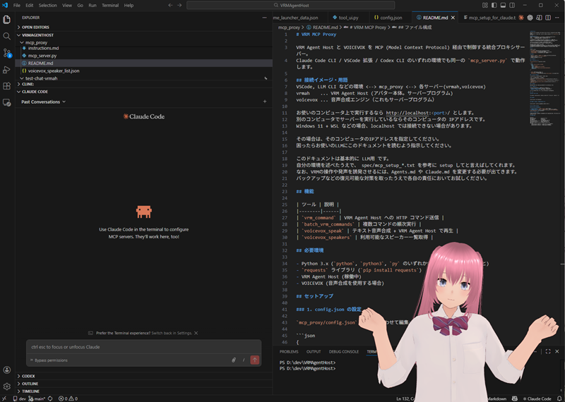

# VRM MCP Proxy

VRM Agent Host(vrmah) と VOICEVOX を MCP (Model Context Protocol) 経由で制御する統合プロキシサーバー。
主に Claude Code CLI / VSCode 拡張 / Codex CLI のいずれの環境でも同一の `vrmah_mcp_proxy.py` で動作します。

- 最初に config.json を自分の環境に適合させる必要があります。
- 別途 VRM Agent Host (仮) が必要です。
- MCPを利用したい環境に合わせて設定します。





## 接続と設定方法の解説・用語 (このセクションは人間・入門者向け)
### MCPの設定
VSCodeの場合: .mcp.json に追加

#### 基本（1つの config で使う場合）
```json
{
  "mcpServers": {
    "vrm_proxy": {
      "command": "python",
      "args": [
        "C:/path/to/VRMAgentHost/vrmah_mcp_proxy/vrmah_mcp_proxy.py"
      ]
    }
  }
}
```
デフォルトで `config.json` が読み込まれます。

#### エージェントごとに config を分ける場合
`--config` オプションで別の設定ファイルを指定できます。
接続先サーバーや音声を分けたい場合に便利です。
```json
{
  "mcpServers": {
    "vrm_proxy_for_claude": {
      "command": "python",
      "args": [
        "C:/path/to/VRMAgentHost/vrmah_mcp_proxy/vrmah_mcp_proxy.py"
      ]
    },
    "vrm_proxy_for_codex": {
      "command": "python",
      "args": [
        "C:/path/to/VRMAgentHost/vrmah_mcp_proxy/vrmah_mcp_proxy.py",
        "--config", "config_for_codex.json"
      ]
    }
  }
}
```
- サーバー名が異なるため、ツール名のプレフィックスも変わります
  - Claude: `mcp__vrm_proxy_for_claude__voicevox_speak` など
  - Codex: `mcp__vrm_proxy_for_codex__voicevox_speak` など
- config ファイルは `vrmah_mcp_proxy/` ディレクトリに配置してください
- CLAUDE.md / CODEX.md 等の ToolSearch クエリも対応するプレフィックスに合わせてください

###  接続イメージ
```
VSCode, LLM CLI などの環境 <--> vrmah_mcp_proxy <--> 各サーバー(vrmah,voicevox)
```
お使いのコンピュータ上で実行するなら `http://localhost:<port>/` とします。
別のコンピュータでサーバーを実行しているならそのコンピュータの IPアドレスです。
Windows 11 + WSL などの場合、localhost では接続できない場合があります。

その場合は、そのコンピュータのIPアドレスを指定してください。
困ったらお使いのLLMにこのドキュメントを読むよう指示してください。


このドキュメントは基本的に AI用 です。
自分の環境を踏まえて以下のように指示すれば設定してくれます。
例:
```
環境は Windows 11 , Powershell + Claude Code
vrmah_mcp_proxy\spec\mcp_setup_*.txt を参考に VRM Agent Host の MCPの設定をして。
```
```
環境は Windows 11 , WSL + Codex
vrmah_mcp_proxy\spec\mcp_setup_*.txt を参考に VRM Agent Host の MCPの設定をして。
```
```
環境は Windows 11 , VS Code + Claude Code
vrmah_mcp_proxy\spec\mcp_setup_*.txt を参考に VRM Agent Host の MCPの設定をして。
```
環境がわからないということはないと思うけど、環境はAI側でも把握できます。
分からなければ安全のため調べてから設定するように言ってください。

なお、claude code から claude code の MCPを設定すると
編集対象のファイルが実行中のセッションと競合すると考えられるので、エラーが出ると思いますが何とかしてくれるはずです。
完了したら CTRL+C などで終了し、claude --resume で再開してください。そして次のように言います。
```
再起動したので挨拶などのテストをしてみてください
```

### 重要
なお、自動的な VRMの操作や発声を誘発させるには、Agents.md や CLAUDE.md に
それらの利用を推奨する記載をするため、変更する必要が出てきます。
以下の内容を記載してください。

#### CLAUDE.md への追記例

```markdown
## Avatar Communication (MCP)

作業の節目で MCP ツールを使い、アバターを通じてユーザーにフィードバックを提供する。
**毎ターン発話しない** - 重要な節目のみ。

### 使用する MCP ツール

| ツール | 用途 |
|--------|------|
| `voicevox_speak` | テキスト音声合成でアバターが発話 |
| `vrm_command` | アニメーション再生・表情変更など |
| `batch_vrm_commands` | 複数コマンドの一括実行 |

### 発話タイミングと内容

| タイミング | 音声（短く） | アニメーション |
|-----------|-------------|---------------|
| 作業開始 | 「了解、やってみるね」 | Idle_energetic |
| 作業完了 | 「できたよ！」 | Idle_cute + Layer_nod_once |
| 確認必要 | 「ここ確認してほしいな」 | Idle_think + Layer_tilt_neck |
| エラー発生 | 「うーん、問題があるみたい」 | Idle_concern |
| 長時間作業中 | 「まだ作業中だよ」 | Idle_calm |

### 実行例
完了時:
  voicevox_speak: text="できたよ！確認してね"
  vrm_command: target=animation, cmd=play, params={"id": "Idle_cute", "seamless": "y"}
  vrm_command: target=animation, cmd=play, params={"id": "Layer_nod_once"}

### ルール
- 音声は1文、15文字以内を目安
- 詳細説明は通常のテキストで
- 連続作業時は最後にまとめて1回
- ユーザーが急いでいる場合は省略可
```

バックアップなどの復元可能な対策を取った上で各自の責任においてお試しください。

### 補足
- vrmah は利用前に起動し、VRMを読み込む等、セットアップ済みの状態にしておいてください。
(手っ取り早く試したい場合、ブラウザで vrmah のエンドポイントを開くと TEST 用のセットアップサンプルがあります)
- voicevox も、利用前に起動しておいてください。　音声は config.json で指定できます。

- ドキュメント中、以下の表現は、IPアドレスが入ります。例：<ip-address-voicevox-candidate> 
<ip-address-vrmah>
<ip-address-voicevox>

### 用語
- `vrmah`    ... VRM Agent Host (アバター本体。サーバープログラム)
- `voicevox` ... 音声合成エンジン（これもサーバープログラム）


## 機能

| ツール | 説明 |
|--------|------|
| `vrm_command` | VRM Agent Host への HTTP コマンド送信 |
| `batch_vrm_commands` | 複数コマンドの順次実行 |
| `voicevox_speak` | テキスト音声合成 + VRM Agent Host で再生 |
| `voicevox_speakers` | 利用可能なスピーカー一覧取得 |

## 必要環境

- Python 3.x (`python`, `python3`, `py` のいずれかが PATH に通っていること)
- `requests` ライブラリ (`pip install requests`)
- VRM Agent Host (稼働中)
- VOICEVOX (音声合成を使用する場合)

## セットアップ

### 1. config.json の設定

`vrmah_mcp_proxy/config.json` を環境に合わせて編集:

```json
{
  "vrmah": {
    "host": "http://<ip-address-vrmah>:34560",
    "candidates": ["http://<ip-address-vrmah-candidate>:34560"]
  },
  "voice": {
    "type": "voicebox",
    "server": "http://<ip-address-voicevox>:50021",
    "candidates": ["http://<ip-address-voicevox-candidate>:50021"],
    "name": "櫻歌ミコ",
    "speaker_uuid": "0693554c-338e-4790-8982-b9c6d476dc69",
    "style_id": 43
  }
}
```

- `vrmah.host`: VRM Agent Host のアドレス
- `vrmah.candidates`: フォールバック先（`host` に接続できない場合に試行）
- `voice.server`: VOICEVOX のアドレス
- `voice.candidates`: VOICEVOX のフォールバック先
- `voice.style_id`: 使用するスピーカーの ID（`voicevox_speakers` ツールで確認可能）

エージェントごとに接続先を変えたい場合は `config_for_codex.json` のように別ファイルを作成し、
`--config` オプションで指定します（上記「エージェントごとに config を分ける場合」参照）。

### 2. 環境別セットアップ

利用環境に応じたセットアップ手順を参照してください:

| 環境 | セットアップ手順 | 設定ファイル |
|------|-----------------|-------------|
| VSCode 拡張 | [spec/mcp_setup_for_vscode.txt](spec/mcp_setup_for_vscode.txt) | `.mcp.json` |
| VSCode グローバル | [spec/mcp_setup_for_vscode_global.txt](spec/mcp_setup_for_vscode_global.txt) | `~/.claude.json` / `~/.codex/config.toml` |
| Claude Code CLI | [spec/mcp_setup_for_claude.txt](spec/mcp_setup_for_claude.txt) | `~/.claude.json` |
| Codex CLI | [spec/mcp_setup_for_codex.txt](spec/mcp_setup_for_codex.txt) | `~/.codex/config.toml` |

### 3. VRM Agent Host の初期化（必要な場合のみ）

VRM Agent Host が既に起動中でセットアップ済み（VRM ロード済み）であれば、このステップは不要です。
VRM が読み込まれていない場合や、ユーザーから初期化を指示された場合に、以下のスクリプトを実行してください:

- Windows (cmd): `setup/setup_example.bat`
- Windows (PowerShell): `setup/setup_example.ps1`
- Linux / WSL: `setup/setup_example.sh`

スクリプト内の `SERVER` 変数を自分の環境に合わせて変更してください。

### 4. 接続確認

各環境でセッションを再起動後、上記4つのツールが利用可能になります。

## フレーミング対応

本サーバーは以下の2つのフレーミング方式に対応しています:
- **Content-Length フレーミング** (LSP 方式): VSCode 拡張が使用
- **NDJSON フレーミング** (改行区切り JSON): CLI ツールが使用

初回メッセージから自動検出するため、利用者側の特別な設定は不要です。

## 使用例

### アニメーション再生

```
vrm_command: target=animation, cmd=play, params={"id": "Idle_cute", "seamless": "y"}
```

### 音声合成

```
voicevox_speak: text="こんにちは"
```

### 組み合わせ（アバターコミュニケーション）

```
voicevox_speak + animation で発話しながらアニメーション
```

## トラブルシューティング

### MCP サーバーが接続できない

1. **Python パスの確認**: `python --version` が動作するか確認
2. **requests の確認**: `python -c "import requests"` がエラーにならないか確認
3. **VRM Agent Host の稼働確認**: ブラウザまたは curl で `http://<ホスト>:34560/?target=vrm&cmd=getLoc` に応答があるか確認

### ツールが表示されない

セッションを完全に再起動してください。既存セッションでは新規登録した MCP サーバーを認識しないことがあります。

## ファイル構成

```
vrmah_mcp_proxy/
├── vrmah_mcp_proxy.py              # MCP サーバー本体
├── config.json                # 接続設定（デフォルト）
├── config_for_codex.json      # Codex 用接続設定（--config で指定）
├── README.md                  # このファイル
├── instructions.md            # API クイックリファレンス
├── detailed_instructions.md   # API 詳細リファレンス
├── animation_ids.txt          # アニメーション ID 一覧
├── voicevox_speaker_list.json # VOICEVOX スピーカー一覧
├── english                    # 英語版（日本語環境では利用しません）
├── setup/
│   ├── setup_example.bat      # VRM Agent Host 初期化スクリプト (cmd)
│   ├── setup_example.ps1      # VRM Agent Host 初期化スクリプト (PowerShell)
│   └── setup_example.sh       # VRM Agent Host 初期化スクリプト (bash)
└── spec/
    ├── mcp_setup_for_claude.txt        # Claude Code CLI 用セットアップ
    ├── mcp_setup_for_codex.txt         # Codex CLI 用セットアップ
    ├── mcp_setup_for_vscode.txt        # VSCode 拡張用セットアップ（プロジェクト単位）
    └── mcp_setup_for_vscode_global.txt # VSCode グローバル環境用セットアップ
```

## Change Notes
2026-03-31 00 Renamed, mcp_proxy.py to vrmah_mcp_proxy.py